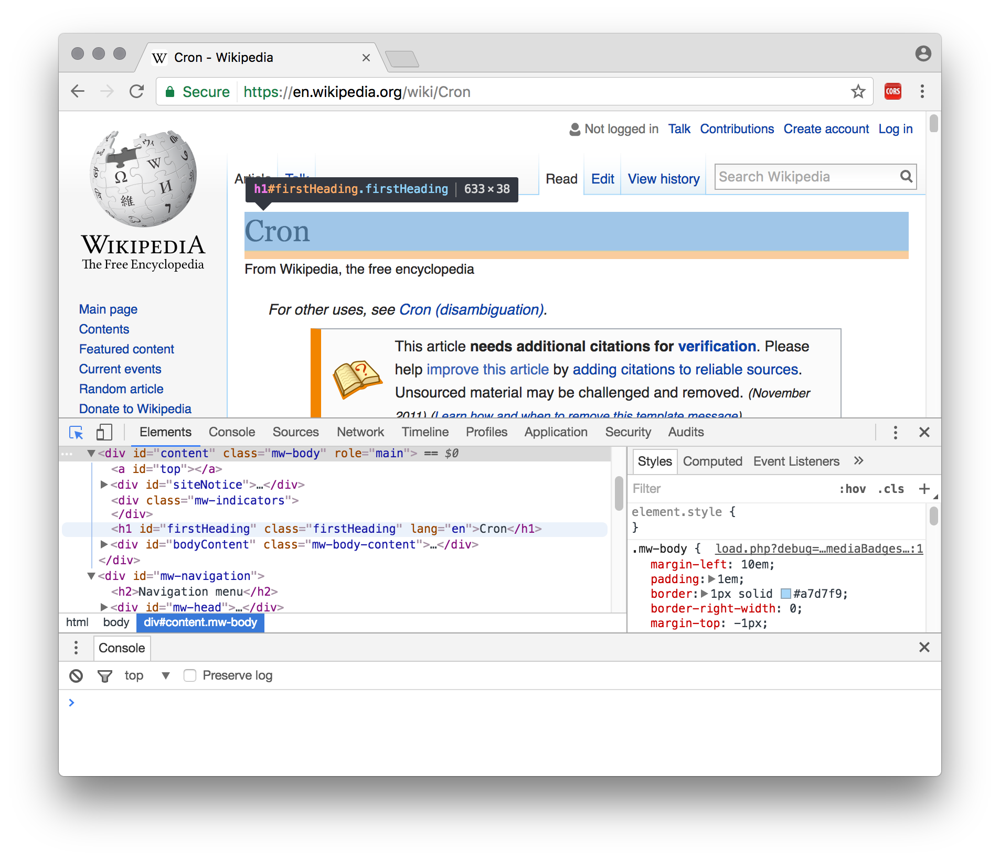
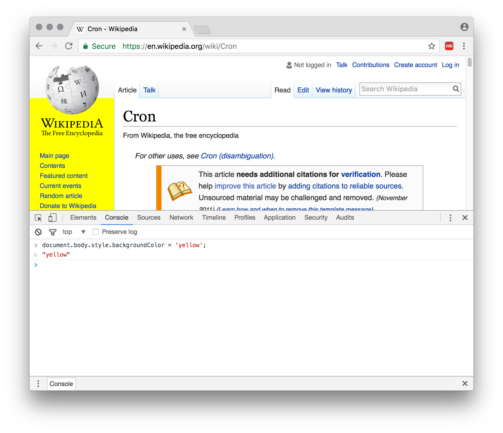

# Web Scraping for Researchers: press Cmd + Alt + I


Most years [at Sussex](http://sussex.ac.uk/economics/gmackerron), I run a two-hour practical session for quantitative researchers on the topic of Regular Expressions (see [slides & teaching materials](http://mackerron.com/text/)).

This year, I got asked to cover some basic web scraping techniques too. This set me thinking — what are the best tools for web scraping? And are these also the best tools with which to teach it?

_Web scraping is the process of extracting useful data from web pages — with appropriate regard to copyright and [database rights](https://www.twobirds.com/en/news/articles/2004/uk-database-rights-defined) — which commonly also requires automating a series of interactions with those pages._

I took to Google, refreshing my memory on programming language libraries like [Scrapy](https://scrapy.org/) (Python) and Mechanize ([Ruby](https://github.com/sparklemotion/mechanize), [Perl](http://search.cpan.org/dist/WWW-Mechanize/)), native GUI scraping applications, and online scraping services. 

And then I remembered that time last year when I copied all my shopping favourites from one [Ocado](http://www.ocado.com) account to another using only Google Chrome, and the answer hit me right in the face. 

Arguably the best web scraping approach uses nothing but a common-or-garden web browser and its built-in developer tools.


## How it works

All modern web browsers provide tools to help web developers design and debug their pages, styles and scripts. Two of these tools are especially helpful for web scraping:

1. **Elements inspector** or **web inspector**. This lets us to point and click on an element, and be taken to its corresponding HTML source and styles. We can use this to work out how to specify the content we want scraping.



2. **Console**. This allows us to type (or paste in) and execute JavaScript code, in the context of the current page. Here we can write simple code to extract data from the page, and also to automate navigation on to further pages.



We'll discuss exactly what code to write after considering the advantages and disadvantages of this scraping approach. Or you can dive straight in to the [example JavaScript code](scraping-example-v2.js).


## Pros and cons 

### Teaching

This approach has several advantages for teaching.

* **The tool is familiar and ubiquitous**. We can scrape this way anywhere a modern web browser is available, including cluster PCs and students' own machines. Chrome, Firefox, Safari, Edge and (recent) IE can all join in.

* **There's a friendly GUI for exploring page elements**. It's therefore easy to switch back and forth between investigating a page's structure interactively, and writing code to extract the bits we care about (using CSS selectors, XPath expressions, and/or Regular Expressions).

* **The skills involved are valuable and transferable**. Writing JavaScript and using the web inspector will help students understand how the web pages they are scraping actually _work_. And these skills are potentially highly transferrable to another valuable domain: creating students' own web pages.


There are also a couple of possible disadvantages:

* **There's a fair bit for students to learn**. Certainly there's a higher barrier to entry than when using a web- or GUI-based option. They'll need to get to grips with basic HTML, CSS selectors, and JavaScript. (It's also easy to see this opportunity for learning as an advantage, though!).

* **It uses JavaScript**. While JavaScript can be unfairly maligned, it's still arguably not quite so fun or beginner-friendly as Ruby, or as widely known by researchers as, say, Python or Matlab.


### In general

This approach also has some key advantages in its own right, teaching or no.

* **It's very likely to Just Work**. Websites are designed for browsers, and browsers offer everything websites might require to display properly: script execution, plugins, cookies, referrer headers, an interactive log-in facility, etc. 

* **... even if people are trying to stop us**. This point extends even to sites that might try to detect and block scraping activity. If we're scripting a real user's real web browser, the only way the server can figure out what's going on is by looking at the delay between requests (which is easy to randomise and extend) and the volume of information being requested.


There are also a few potential disadvantages relative to some of the other options.

* **It's hard to schedule**. This scraping method is not easy to schedule repeatedly (e.g. via a [cron](https://en.wikipedia.org/wiki/Cron) job on a remote server) if repeated snapshots are required — for example, if we're after daily or hourly weather forecasts, or stock market data. On the other hand, it might instead be possible to schedule simple page downloads, and subsequently use the approach outlined here to process the downloaded HTML files offline.

* **Scalability may be limited**. Scaling our scripts to robustly scrape very large data sets (especially in the face of network errors) may be slightly trickier than when using a dedicated scraping library. Maybe.


## How to do it

So, what code do we need to write in the Console?

For exposition, I've divided the code into five parts. Happily, four of the five are supporting functionality that will probably remain untouched between different scraping tasks. I'll deal with these first.

### `start()`

```javascript
function start() {
  textarea = document.body.appendChild(document.createElement('textarea'));
  iframe = document.body.appendChild(document.createElement('iframe'));

  var commonStyles = { position: 'absolute', left: '2%', width: '96%', border: '2px solid #0af' };
  Object.assign(textarea.style, commonStyles, { bottom: '2%', height: '26%' });
  Object.assign(iframe.style, commonStyles, { top: '2%', height: '66%' });

  iframe.addEventListener('load', process, false);
  iframe.contentWindow.location.href = window.location.href;
}
```

We begin with a function that sets us up by making and styling two new page elements. These elements are deliberately allowed to leak into the global scope (by omitting `var`), so we can address them later.

1. A `<textarea>`. This is a good place to output the data we're going to scrape. It's automatically scrollable and will display text as-is, not as HTML.

2. An `<iframe>`. This is more or less a browser window inside a browser window. We will load the pages we want to scrape inside of this.

_**Q: Why an `<iframe>`?** A: We can't load new pages straight into the current window, because that would wipe out the code we are writing here. We could load new pages in another window or tab instead, but (a) this requires us to disable popup-blocking in some browsers, and (b) getting notified when a page has loaded in another window or tab is tricky._

Once we've created the `<iframe>`, we ask to be notified every time a new page loads inside it (using `addEventListener`). Then we point it to our first scraping location. We set this location as the URL of the current page.

_**Q: Why the current page URL?** A: Using the current URL is a nice, simple way to communicate our starting point to the script. But more importantly, browsers won't allow one website to access pages from another website, for reasons of security and privacy. So if we want to access a page to scrape its content, we need our script to appear to come from the same website (as judged by the domain — e.g. mackerron.com). In the console, our scripts appear to come from whatever page is currently loaded — so to make it all work, we need to load a page from the scraping target domain._ 

Unsurprisingly, we'll call this `start()` function when we're ready to begin.


###  `write(value1, value2, ...)`

```javascript
function write(/* any number of arguments */) {
  var columns = Array.from(arguments).map(function (value) {
    var t = typeof value;
    return value == 'null' ? '' :
      t == 'number' ? String(value) :
      t == 'boolean' ? (value ? '1' : '0') :
      value instanceof Date ? value.toISOString().replace('T', ' ').replace('Z', '') :
      '"' + String(value).replace(/"/g, '""') + '"';
  });

  var fullyScrolled = textarea.scrollTop >= textarea.scrollHeight - textarea.clientHeight - 1 ||
    textarea.clientHeight >= textarea.scrollHeight;  
  textarea.value += columns.join(',') + '\n';
  if (fullyScrolled) textarea.scrollTop = textarea.scrollHeight - textarea.clientHeight;
}
```

This function writes its arguments into the `<textarea>`, as the columns of one row of a CSV file. It operates sensibly with numbers, booleans, text, `Date` objects, and `null` and `undefined`. Text is 'escaped' so that the CSV format isn't screwed up by variables containing commas, newlines and double quotes. Dates come out in a UTC/GMT format that's readable by both humans and Excel.

The function also keeps the `<textarea>` scrolled to the bottom (if we haven't manually scrolled it up), where we can see new data as it is added.

We call this function every time we've scraped a new row of data from a target web page and want to save it somewhere.


### `abort()`

```javascript
function abort() {
  clearTimeout(clickTimeout);
  iframe.removeEventListener('load', process, false);
}
```

We call this function if we ever need to stop our scraping process prematurely. It stops the next action (and thus all subsequent actions) happening, whether that's processing a loaded page or loading a new one.


### Polyfills: `Array.from()` and `Object.assign()`

```javascript
if (!Array.from) Array.from = function (arraylike) { return [].slice.call(arraylike); };
if (!Object.assign) Object.assign = function (o1) { 
  [].slice.call(arguments, 1).forEach(function (o2) { for (var key in o2) o1[key] = o2[key]; });
};
```

We include a couple of limited [polyfills](https://en.wikipedia.org/wiki/Polyfill) to stop up gaps in Internet Explorer's JavaScript support. The `if` statements mean they have no effect in other browsers.


### Where the action happens: `process()`

All our custom scraping work happens in this function. This is the one you will definitely need to change when applying this scraping technique to other sites and data sets.

The function shown here implements a simple example scraping job, which is to extract [vote counts for UK government petitions](https://petition.parliament.uk/petitions?state=with_response). I've picked only those with a government response, which are spread across (at the time of writing) nine pages.

```javascript
function process() {
  console.log('Processing', iframe.contentWindow.location.href);
  var doc = iframe.contentDocument;
  var timestamp = new Date();

  Array.from(doc.querySelectorAll('.petition-item')).forEach(function (item) {
    var count = parseInt(item.querySelector('.count').getAttribute('data-count'));
    var title = item.querySelector('h3 a');
    var name = title.text;
    write(count, name, timestamp);
  });

  var nextLink = doc.querySelector('a.next');
  if (nextLink) clickTimeout = setTimeout(function () { nextLink.click(); }, 500);
  else console.log('Finished.');
}
```

First, we take a reference to the document loaded inside the `<iframe>`, and the current date, which we will output as a timestamp for the data scraped on this page. 

Next, we select every page element with CSS class `petition-item`, by calling `querySelectorAll()`, and iterate over the returned elements — extracting the data we are interested in, and calling `write()` with the results.

Finally, we look for a [Next] button, again by CSS class. 

If one is found, we simulate a click on it, to navigate the next page. But we insert a half-second delay before doing so, via `setTimeout`, to play nice and avoid pummelling the server. Once the next page has loaded, the `load` callback already attached to our `<iframe>` will ensure this function, `process()`, is called again.

Alternatively, if no [Next] button is found, we have reached the end of the petitions list, and we call it a day.

### Finishing up

Once this script has finished executing (as signalled by the message 'Finished.' appearing in the Console), we can simply copy all the text in the `<textarea>` (click, Ctrl/Cmd-A, Ctrl/Cmd-C), paste into TextEdit or Notepad, and save with a .csv extension, ready to open in Excel, R, Stata, etc.

The [complete example code](scraping-example-v2.js) is ready to paste straight into the Console and see working.

## Level II

You can apply this same method to more complex scraping tasks, involving inexact text matching, following links, triggering asynchronous page updates and waiting on DOM mutations to indicate they are finished, and so on. Modern JavaScript — especially  `async`/`await` — makes this much more palatable. See this [more advanced example](advanced/advanced-scraping-example.js).

## Feedback

I hope you find this technique useful. Please do get in touch with any feedback, or submit an issue or pull request.

Regarding intellectual property, the [example JavaScript code](scraping-example-v2.js) is [MIT licenced](https://opensource.org/licenses/MIT). All rights in this tutoral text are reserved by [the author](http://sussex.ac.uk/economics/gmackerron) (do contact me if you have some use in mind).

